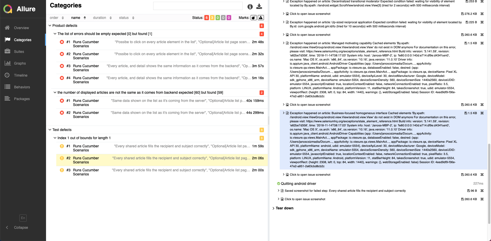
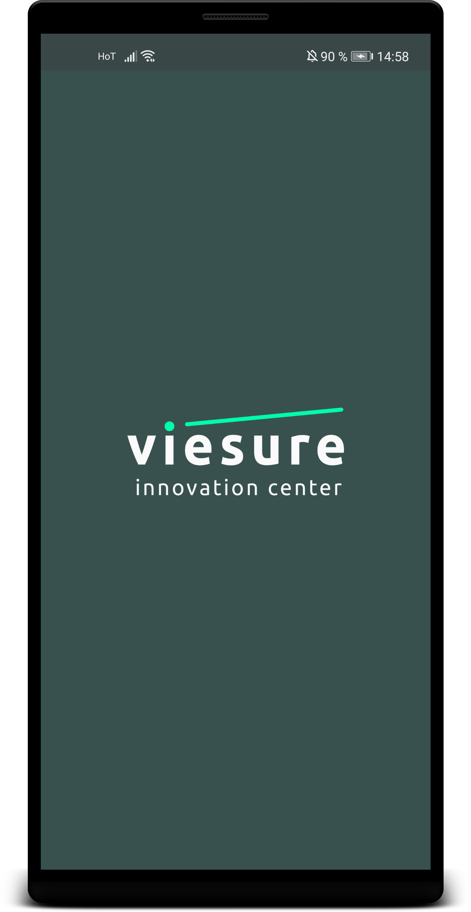
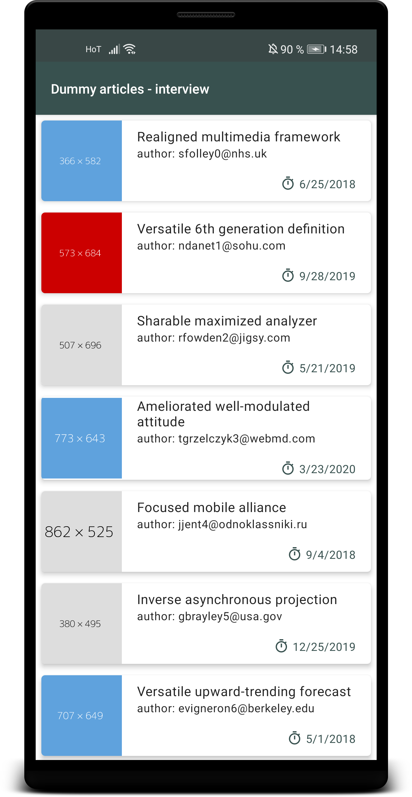
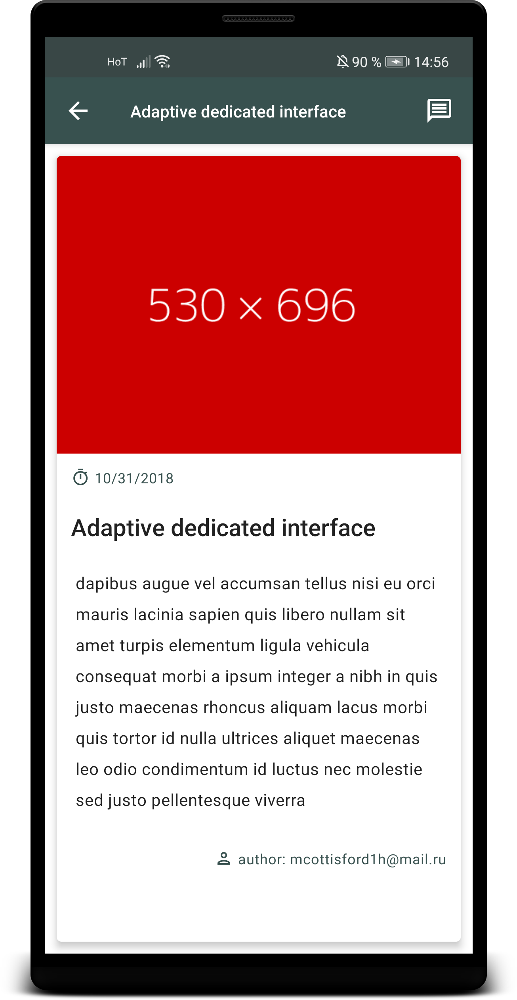

# mobile-qa-interview hand-in readme

## Dependences used for the project:

* java-client
* testng
* allure-testng
* cucumber-testng
* cucumber java
* cucumber picocontainer (For Dependency Injection)
* rest assured (to make GET request to the mock backend)
* gson (parsing and converting response from rest assured)
* commons io (for copying directories for allure report history)

## The assignment

### prologue
Running the tests (on remote selenium grid) requires a selenium hub and node configured. 
I had both the hub and the 2 nodes I used configured on my local machine, 
although having it run on a remote machine differs only in the URL used to initalize the drivers.

#### Setting up selenium grid (wether remote or local)
* The HUB requires selenium (Grid) standalone server downloaded `https://www.selenium.dev/downloads/`
  * Starting the server:`java -jar selenium-server.jar -role hub`
  
* I have used 2 nodes, configured for 2 differend android emulators
  * Node1: Pixel XL API 30
  * Node2: Nexus S API 24
  * To register nodes run: `appium -p 4728 --nodeconfig nexusConfig.json` 
    (Example command for setting up the node for the Nexus device)
  * Example node config JSON-s are attached in src/main/resources/properties folder
      * nexusConfig.json
      * pixelConfig.json
  *config hubHost, hubPort, port ...etc properties have to be changed in respect of the server's IP/port and the actual configs used

#### Maven, TestNG, Properties and configurations

When we start running our tests `paralellTestng.xml`, through maven the following will happen. 
The maven-surefire-plugin, will execute the file that is given to it inside the `<suiteXmlFile>` tags. here, 
I did not set any other parameters ( like run paralell or threadCount). 
these are set inside the `paralellTestng.xml` file (so there's no conflict).
For the cucumber tests, I have set up global hooks in `GlobalHooks.java` 
and the code execution will start in the @Before method called setUp.
This method moves the Allure report history, into the results folder,
and also initalizes my drivers. The drivers are being initalized by the given device parameter in `paralellTestng.xml`
(also if the parameter happens to be missing for some reason, the code defaults to 'pixel' ).
After getting the device parameter or the default device, based on the parameter 
a property file will be loaded with that device's data and used for the capabilities, and setting up the remote URL.

When this is done, the execution moves to execute the runner(s) defined in `paralellTestng.xml`. 
The current runner is the `RegressionTestRunner.java` that runs scenarions tagged with @regression

#### Cucumber

My **cucumber feature files** can be found in `src/main/resources/pages`.
* **ArticleList.feature** - contains scenarios related mainly to the list page
* **ArticleDetailPage.feature** - contains scenarios related to the detail page

For the scenarios I have added different tags, so different runners / run modes can be made upon requirement.
* **@regression** (all tests have this tag)
* **@slow** (tests that do tests something on the whole list page are tagged with this)
* **@gmailLoggedIn** (tests that require the gmail app to be logged in)
* **@backend** (tests that compare data with backend results)
* **@showcase** (tests where I used some extra cucumber features as a 'showcase' of understanding)

The **step definitions** for thease features can be found in: `src/test/java/steps`. 
Although step definitions could be placed theoretically in one class, 
I've placed them in some different classes for better readibility and reusability.
* **ArticleDetailSteps** (step implementation for the article details)
* **ArticleListSteps** (step implementation for article list test)
* **WholeListSteps** (step implementations for tests that do use all list item in the list page)

Other classes in this package `src/test/java/steps`
* **CommonVerifyers** - Used in most step definition classes to verify elements
* **GlobalHooks** - Global cucumber hooks are defined here, along with driver initalization and paralell 'thread handling'

**Test Runners** are found under `src/test/java/org/viesure/testRunner`
* Runners found here are using the feature files and glues them to the step definitions.
* Each runner file run differently tagged scenarios (eg. RegressionTestRunner runs scenarios with @regression)
* If needed multiple tags could be used in a single testRunner, I just did not use it currently

#### POM pattern

The Page Object Model design pattern was used (as it is still the best practice).
the Page Objects created can be found in `src/main/java/org/viesure`.

Page objects were created for:
* **ArticleListPage**
* **ArticleDetailPage**
* **GmailPage** (just a very minimalistic one to be able to check recipient, subject and body)

#### Helper classes

Some helper classes were created in the `src/main/java/org/viesure/utils` package to manage allure, 
or networking needs.
* **Allurelogger** - Used for adding text or screenshot attachments to Allure reports
* **FileUtil** - Used for loading device properties from resources, and to move allure history data
* **Gestures** - Gestures that were needed for tests ( like scrolling) are implemented here
* **Networking** - A class that uses `rest-assured` to load data from backend, and also parses it to Article type

#### Other notes

* Due to **time limitations**, I did not create any login flow for the gmail application, 
  I have just created a test account and logged in with it on the emulator.

## Final Test Results

During the automation tests, the following issues were found by the test automation:
* **scenario**: Possible to click on every article element in the list
  * **Decentralized transitional moderator** could not be clicked
* **scenario**:  Every article, and detail shows the same information as it comes from the backend
  * **Decentralized transitional moderator** could not be clicked
* **scenario**:  Every shared article fills the recipient and subject correctly
  * **Up-sized reciprocal application** Article's share button does not navigate to gmail app
* **scenario**:  Same data shown on the list as it's coming from the server
  * We are displaying 59 articles, but backend sends 60 articles
  
The tests were run paralelly on 2 nodes with 2 different API level Android emaultors. 
both node found and reported these same issues

## Final Test Run Report Screenshots


# mobile-qa-interview
## Application overview

| Launcher screen  | Article list | Article Detail Screen |
| ---------------- | ------------ |---------------------- |
|  |  |  |

### Launcher screen: 
A splash screen with Viesure logo that appear while the application is launching.

### Article screen: 
In this screen we,
* fetch a list of dummy articles from `https://run.mocky.io/v3/de42e6d9-2d03-40e2-a426-8953c7c94fb8` with the following data structure:

```json
{
  "id": 1,
  "title": "Realigned multimedia framework",
  "description": "nisl aenean lectus pellentesque eget nunc donec quis orci eget orci vitae mattis nibh ligula",
  "author": "sfolley0@nhs.uk",
  "release_date": "6/25/2018",
  "image": "http://dummyimage.com/366x582.png/5fa2dd/ffffff"
}

```
* Show article's `image`, `title`, `author` and `release_date` in a list.

### Detail screen:
when user select an article -from list mentioned above- we show its information in a separate page. This page contains the following elements:
* An action bar which contains:
  * Title of a given article
  * Back button (redirects user to the previous screen)
  * Send message action menu, which launches the native mail application with author's email address and article's title as subject.
* Article header image
* Article release date
* Article title
* Article description
* Article's author

## About the app
| Platform  | Minimum API version | Application id (bundle id) | Application main (launcher) Activity | Artifact |
| --------- | ------------------- |--------------------------- | ------------------------------------ | -------- |
| Android | [](https://android-arsenal.com/api?level=23) | `io.viesure.qa` | `io.viesure.qa.views.MainActivity` | [download APK](./app/android/qa-interview.apk) |

## Your task
You need to implement a test automation for the application (see above) using Cucumber and Appium through TestNG.
* Define Cucumber scenarios
* Use the following farmeworks/technologies within the automation project:
  * Appium with Selenium Grid.
  * Executed Cucumber in parallel using TestNG and Maven.
  * Allure Framework for reporting.
* Include the final automated test result/report in the readme.
* Open a pull request containing automation source code and an informative readme.

## Next Step
Our mobile development team will review your task carefully and contact you as soon as possible.


